# Milestone-2-Troublesome-Dimensions

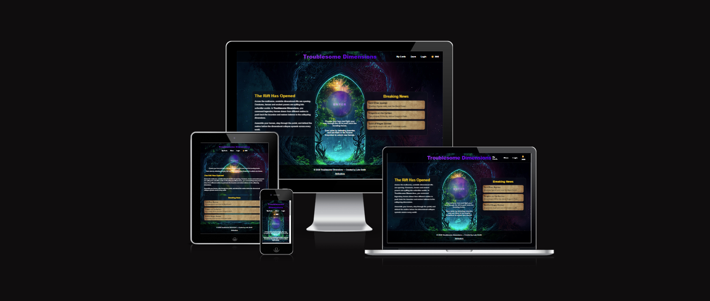

---

## Project Overview

**Troublesome Dimensions** is an interactive browser-based fantasy card battle game. Players enter a fractured multiverse where dimensional rifts have unleashed creatures and heroes from different realms.

The user selects a hero card and battles against an opponent using a simple turn-based combat system. Each card has unique attacks and health values, creating variation in gameplay.

This project focuses on building a strong front-end experience using **HTML, CSS, and JavaScript**, with clear structure, interactive gameplay, and responsive design.

---

## UX (User Experience)

### Target Audience

- Casual gamers  
- Fantasy and RPG fans  
- Users looking for quick browser-based gameplay  
- Beginner users who prefer simple mechanics  

---

### User Goals

- Understand the purpose of the site immediately  
- Enter the game easily from the homepage  
- Select a character and begin a battle  
- Receive clear feedback (win/lose outcome)  
- Try different cards and outcomes  

---

## User Stories

### First-Time User

- I want to understand what the game is about  
- I want clear instructions on how to start  
- I want an obvious way to enter the game  

### Returning User

- I want to try different hero cards  
- I want to improve my outcomes in battle  
- I want a quick and smooth experience  

### Frequent User

- I want more variety in gameplay  
- I want to unlock or collect additional cards  
- I want expanded features in future updates  

---

## Features

### Homepage

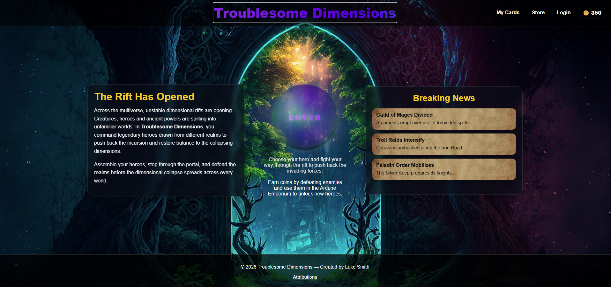

- Lore-based introduction to the game  
- Clear call-to-action portal  
- Breaking News panel for immersion  

---

### Card Selection

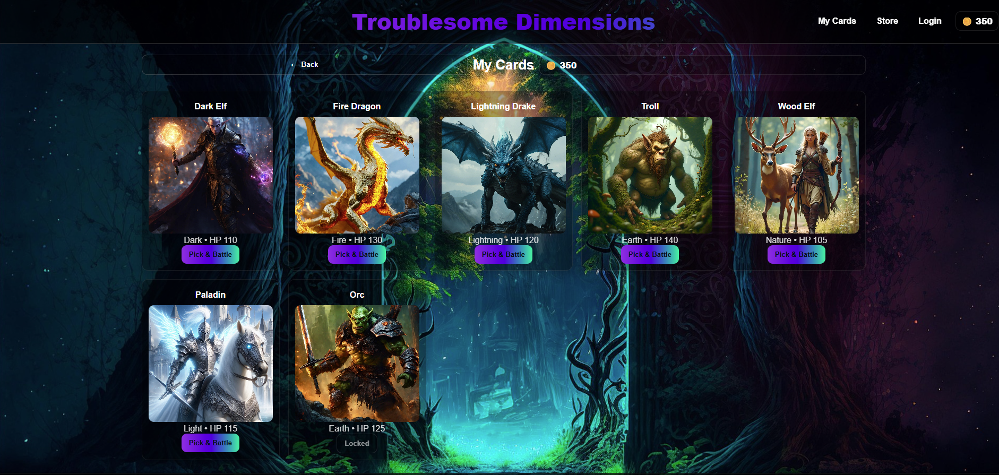

- Displays available hero cards  
- Locked/unlocked system  
- Easy selection to start battle  

---

### Battle System

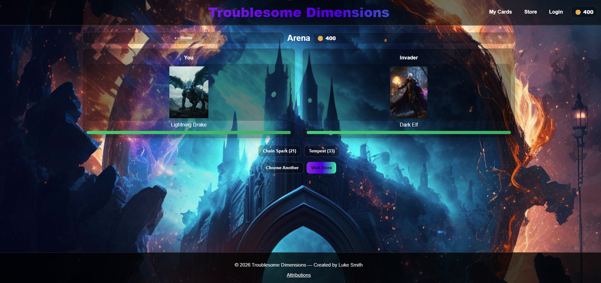

- Turn-based combat  
- Attack buttons with damage values  
- HP bar system for both player and opponent  

---

### Store

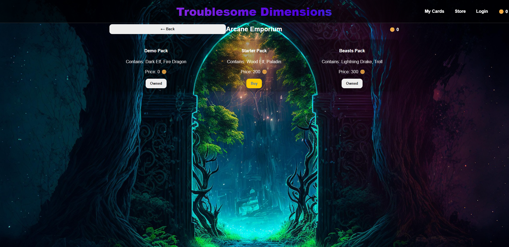

- Purchase card packs using coins  
- Unlock new characters  

---

### 404 / Login Page

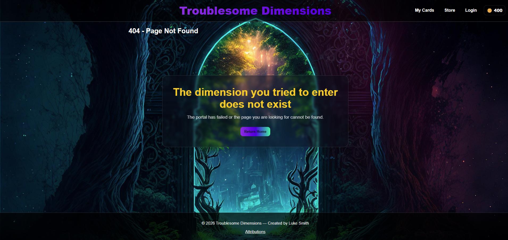

- Custom themed 404 page  
- Keeps design consistent with the game  

---

## Wireframes

Wireframes were not formally created for this project.  

Instead, the layout and structure were designed directly in the browser using an iterative development approach. This allowed for continuous visual adjustments and improvements based on testing and usability.

However, the design followed a clear structure:

- Left panel: Game lore / introduction  
- Center: Main portal interaction (call-to-action)  
- Right panel: News / additional content  
- Separate views for:
  - Card selection  
  - Battle screen  
  - Store  

Future development would include creating low-fidelity wireframes during the planning phase to better visualise layout and user flow before implementation.

---

## Gameplay Instructions

1. Click the **Enter portal** button on the homepage  
2. Select a hero card from your available cards  
3. Begin the battle against the opponent  
4. Click attack buttons to deal damage  
5. Monitor health bars for both characters  
6. Win by reducing the opponent's HP to zero  
7. Lose if your HP reaches zero  
8. Return and try again with different strategies  

---

## Technologies Used

- HTML5  
- CSS3  
- JavaScript (Vanilla JS)  
- LocalStorage (for saving coins and progression)  

---

## Testing Procedures

To assess functionality, usability, and responsiveness, both manual and automated testing methods were used.

### Manual Testing

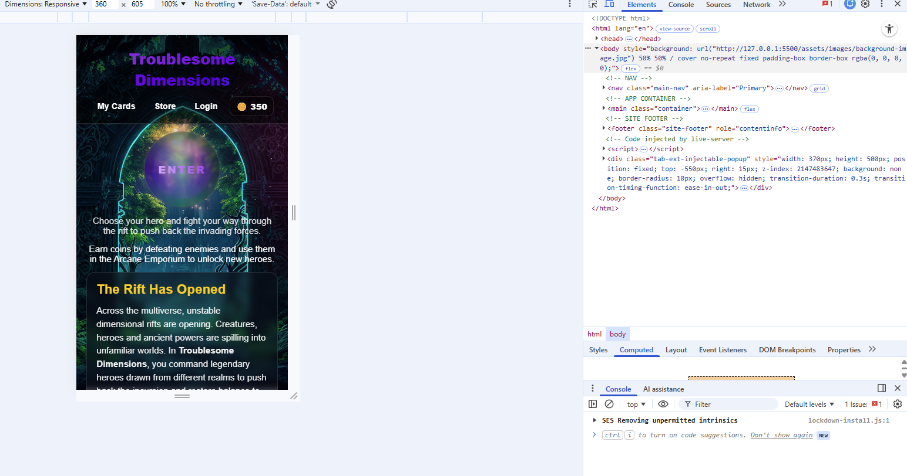

- Navigation between all views  
- Card selection and battle flow  
- Attack functionality and HP updates  
- Win/loss conditions and coin rewards  
- Button responsiveness  
- Mobile and tablet layout testing  

---

### Automated Testing

- Chrome DevTools  
- Lighthouse  
- HTML Validator  
- CSS Validator  

---

## HTML Validation

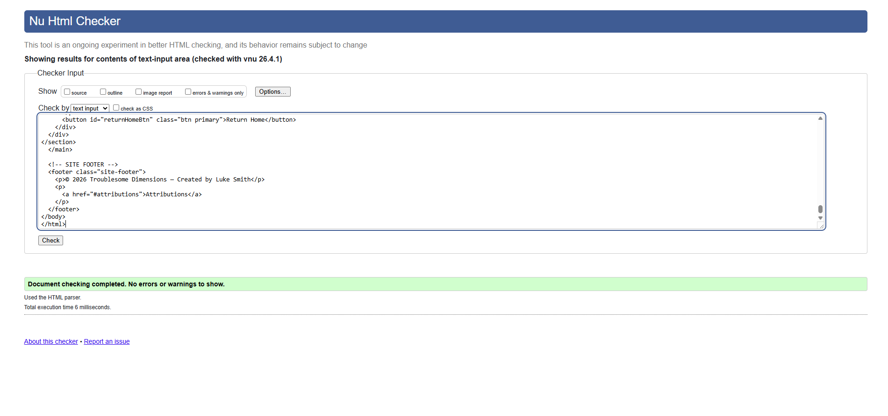

- No critical errors  
- Minor warnings reviewed and corrected where appropriate  

---

## JavaScript Validation

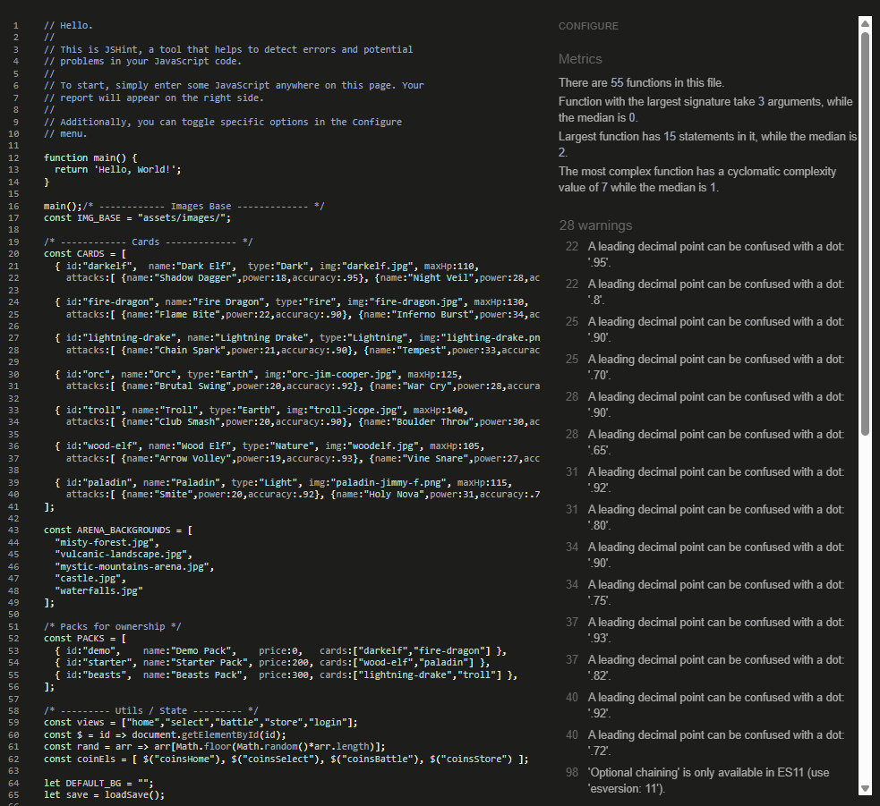

- ES6 syntax warnings (supported in modern browsers)  
- Decimal formatting suggestions  

---

## Performance Testing

### Mobile

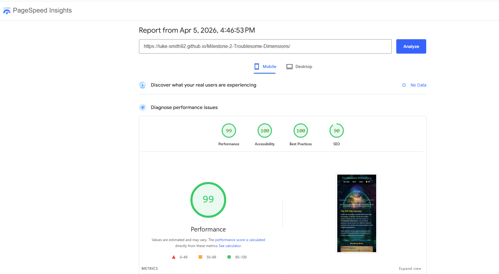

### Desktop

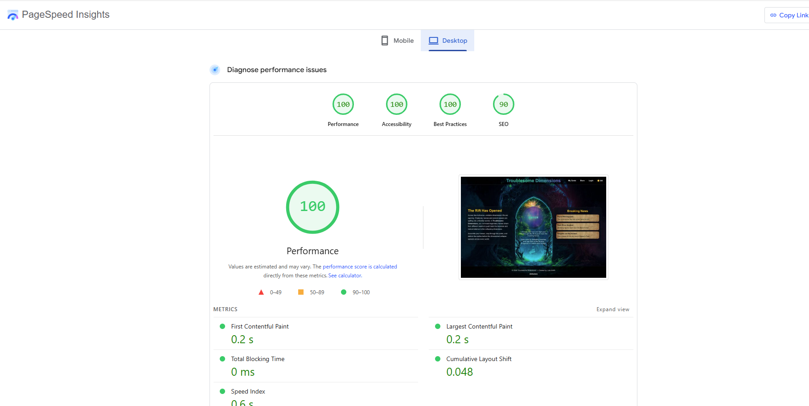

#### Results

- Performance: 99 (Mobile) / 100 (Desktop)  
- Accessibility: 100  
- Best Practices: 100  
- SEO: 90  

---

## Bugs and Fixes

### Battle Image Sizing Issue

- Images appeared too large and were cut off  
- Issue caused by incorrect CSS selector  
- Fixed using `#battle .card img`  
- Applied `object-fit: contain`  

---

## Responsive Testing

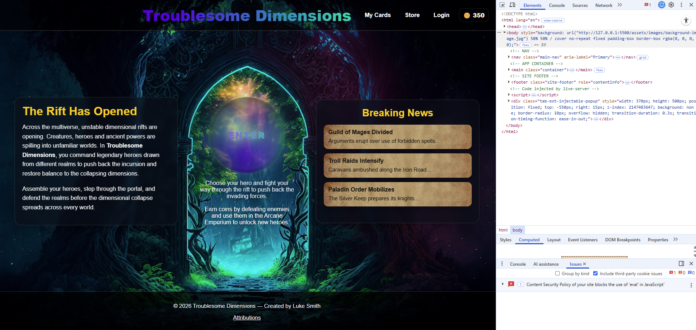

- Layout tested across multiple screen sizes  
- Mobile, tablet, and desktop compatibility confirmed  

---

## Deployment

This project is deployed using **GitHub Pages**.

Live site:  
https://luke-smith92.github.io/Troublesome-Dimensions/

---

## Credits

### Content

- Game concept and development by Luke Smith  

### Media

- Images sourced from Pixabay and other free-use platforms  

### Acknowledgements

- Assistance and guidance provided through various learning resources  
- Code Institute course materials and Discord community support  
- Online research using Google  
- AI tools used to support debugging, problem-solving, and code explanations  