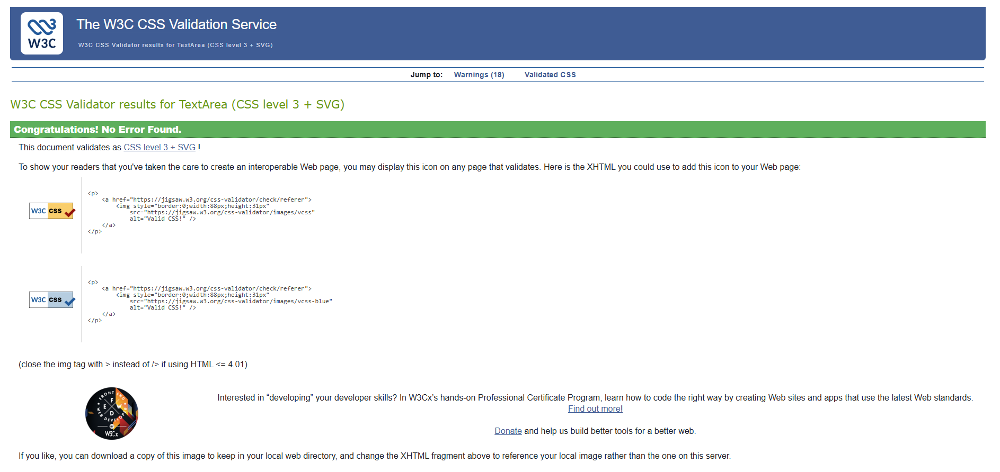

# Milestone-2-Troublesome-Dimensions

---

## Project Overview

**Troublesome Dimensions** is an interactive browser-based fantasy card battle game. Players enter a fractured multiverse where dimensional rifts have unleashed creatures and heroes from different realms.

The user selects a hero card and battles against an opponent using a simple turn-based combat system. Each card has unique attacks and health values, creating variation in gameplay.

This project focuses on building a strong front-end experience using **HTML, CSS, and JavaScript**, with clear structure, interactive gameplay, and responsive design.

---

## UX (User Experience)

### Target Audience

- Casual gamers  
- Fantasy and RPG fans  
- Users looking for quick browser-based gameplay  
- Beginner users who prefer simple mechanics  

---

### User Goals

- Understand the purpose of the site immediately  
- Enter the game easily from the homepage  
- Select a character and begin a battle  
- Receive clear feedback (win/lose outcome)  
- Try different cards and outcomes  

---

## User Stories

### First-Time User

- I want to understand what the game is about  
- I want clear instructions on how to start  
- I want an obvious way to enter the game  

### Returning User

- I want to try different hero cards  
- I want to improve my outcomes in battle  
- I want a quick and smooth experience  

### Frequent User

- I want more variety in gameplay  
- I want to unlock or collect additional cards  
- I want expanded features in future updates  

---

## Features

### Homepage

- Lore-based introduction to the game  
- Clear call-to-action portal  
- Breaking News panel for immersion  

---

### Card Selection

- Displays available hero cards  
- Locked/unlocked system  
- Easy selection to start battle  

---

### Battle System

- Turn-based combat  
- Attack buttons with damage values  
- HP bar system for both player and opponent  

### Scoring and Rewards

- Winning a battle rewards the player with coins  
- Coins can be used in the store to unlock additional card packs  
- Losing a battle does not reward coins, encouraging strategic play  

---

### Store

### Store

- Players can spend earned coins
- Additional card packs can be unlocked
- Provides a foundation for future progression systems

### Store Expansion

The current store system provides a basic method for unlocking additional cards using earned coins.

Future improvements could include:

- Additional card packs
- Rare and legendary cards
- Cosmetic unlocks
- Character upgrades
- Daily rewards
- Expanded progression systems

---

### 404 / Login Page

### Custom 404 Page

Troublesome Dimensions is built as a single-page application rather than using multiple separate HTML pages.

Because of this, the custom 404 page is implemented as a hidden view within the application instead of a standalone HTML page. If a user attempts to access a page or dimension that does not exist, the themed 404 view can be displayed without leaving the application.

The page remains consistent with the fantasy style of the project and provides a clear **Return Home** button. This allows users to return to the main page without relying on browser navigation buttons, helping improve usability and meeting the project requirements.

---

## Wireframes

Wireframes were not formally created for this project.  

Instead, the layout and structure were designed directly in the browser using an iterative development approach. This allowed for continuous visual adjustments and improvements based on testing and usability.

However, the design followed a clear structure:

- Left panel: Game lore / introduction  
- Center: Main portal interaction (call-to-action)  
- Right panel: News / additional content  
- Separate views for:
  - Card selection  
  - Battle screen  
  - Store  

Future development would include creating low-fidelity wireframes during the planning phase to better visualise layout and user flow before implementation.

---

## Gameplay Instructions

1. Click the **Enter portal** button on the homepage  
2. Select a hero card from your available cards  
3. Battles against a dynamic AI-controlled opponent 
4. Click attack buttons to deal damage  
5. Monitor health bars for both characters  
6. Win by reducing the opponent's HP to zero  
7. Lose if your HP reaches zero  
8. Return and try again with different strategies  

---

## Technologies Used

- HTML5  
- CSS3  
- JavaScript (Vanilla JS)  
- LocalStorage (for saving coins and progression)  

---

## Testing Procedures

To assess functionality, usability, and responsiveness, both manual and automated testing methods were used.

### Manual Testing

- Navigation between all views  
- Card selection and battle flow  
- Attack functionality and HP updates  
- Win/loss conditions and coin rewards  
- Button responsiveness  
- Mobile and tablet layout testing  

---

### Automated Testing

- Chrome DevTools  
- Lighthouse  
- HTML Validator  
- CSS Validator  

---

## HTML Validation

- No critical errors  
- Minor warnings reviewed and corrected where appropriate  

---

## CSS Validation

- No critical errors found  
- Minor warnings related to modern CSS features  

---

## JavaScript Validation

JavaScript code was tested using **JSHint** to identify potential issues and improve code quality.

The results showed:

- No critical errors affecting functionality  
- Warnings related to ES6 syntax (supported by modern browsers)  
- Suggestions for decimal formatting (e.g. using 0.95 instead of .95)  
- Minor compatibility notes for older JavaScript versions  

These warnings do not impact the functionality of the application and were reviewed during development.

---

## Performance Testing

### Responsive Testing

- Layout tested across multiple screen sizes  
- Mobile, tablet, and desktop compatibility confirmed  
- No major layout breaks identified during testing  

---

### Mobile Performance

---

### Desktop Performance

---

### Results

- Performance: 99 (Mobile) / 100 (Desktop)  
- Accessibility: 100  
- Best Practices: 100  
- SEO: 90  

Overall, testing confirmed that the application is stable, responsive, and provides a consistent user experience across different devices and screen sizes.
---

## Bugs and Fixes

### Battle Image Sizing Issue

- Images appeared too large and were cut off  
- Issue caused by incorrect CSS selector  
- Fixed using `#battle .card img`  
- Applied `object-fit: contain`  

## Bugs and Fixes

### Battle Image Sizing Issue
- Images appeared too large and were cut off during battles  
- Issue caused by an incorrect CSS selector not matching the dynamically generated battle cards  
- Fixed by targeting `#battle .card img`  
- Applied `object-fit: contain` so the full character image displayed correctly  

---

### Battle Reward / Coin Issue
- Winning battles was awarding the wrong number of coins  
- Issue was caused by reward logic being triggered more than once  
- Fixed by updating the battle end logic so coins are only awarded once per win  
- Result: players now correctly receive the intended reward amount  

---

### Battle Controls Lock Issue
- After a battle ended, the controls could stop responding  
- Issue was caused by the battle `locked` state not being reset correctly  
- Fixed by resetting the lock state once the battle result had been processed  
- Result: the game remains interactive after each match  

---

### Background Overlay Issue
- The arena background became too dark and reduced the vibrancy of the design  
- Issue was caused by the JavaScript background styling overriding the CSS with a heavy overlay  
- Fixed by removing the unnecessary dark overlay from the arena background  
- Result: background images now appear brighter and more visually consistent  

---

### GitHub Pages Deployment Issue
- The live site initially displayed the repository README instead of the project  
- Issue was caused by the main HTML file not being named `index.html`  
- Fixed by renaming the main file to `index.html` and redeploying through GitHub Pages  
- Result: the correct homepage now loads from the live site  

---

### 404 / Login Page Repurposing
- The login page did not fit the final project requirements and needed to function as a 404 page  
- Issue was resolved by redesigning the section as a custom themed 404 page  
- Added a return home button to improve navigation  
- Result: invalid routes now display a themed error page consistent with the rest of the project

---

### HP Bar Calculation Issue

- The health bar did not update correctly during battles  
- Issue was caused by incorrect calculation of remaining HP percentages  
- The width of the HP bar was not properly linked to the current HP values  
- This resulted in the visual bar not matching the actual game state  

- The issue was resolved by correctly calculating the percentage of remaining HP and updating the width dynamically using JavaScript  

- Additional guidance from AI tools (ChatGPT) was used to help identify the calculation issue and improve understanding of the correct implementation
- Result: HP bars now accurately reflect player and opponent health during battles  

---
## Future Improvements

There are several areas where this project could be expanded and enhanced in the future:

### Gameplay Enhancements

- Introduce a wider variety of hero cards with unique abilities, strengths, and weaknesses  
- Add special abilities or status effects (e.g. poison, stun, healing) to increase strategy  
- Implement a progression system where players can level up cards or unlock new content  

---

### Visual and Design Improvements

- Upgrade card visuals from static 2D images to more immersive designs, such as animated or 3D-style elements  
- Add visual effects during battles (e.g. attack animations, transitions, particle effects)  
- Improve UI polish with smoother transitions and enhanced feedback for user actions  

---

### World Building and Lore

- Expand the storyline of the multiverse with deeper lore and background for each faction or character  
- Introduce a campaign or story mode to give players a sense of progression and purpose  
- Add dynamic "Breaking News" updates tied to gameplay events  

---

### Technical Improvements

- Implement a full user authentication system (login/register)  
- Store user progress using a database instead of LocalStorage  
- Improve code structure by modularising JavaScript into separate files  

---

### Feature Expansion

- Add multiplayer functionality (player vs player battles)  
- Expand the store system with more packs, upgrades, and items  
- Introduce achievements or rewards to increase replayability  

---

These improvements would enhance both the user experience and the overall depth of the application, transforming it from a simple browser-based game into a more complete and engaging product.

---

## Deployment

This project is deployed using **GitHub Pages**.

Live site:  
https://luke-smith92.github.io/Troublesome-Dimensions/

### How to Run Locally

1. Clone the repository  
2. Open the project folder in VS Code  
3. Launch with Live Server or open `index.html` in a browser  

---

## Credits

### Content

- Game concept and development by Luke Smith  

### Media

- Images sourced from Pixabay and other free-use platforms  

### Acknowledgements

- Assistance and guidance provided through various learning resources  
- Code Institute course materials and Discord community support  
- Online research using Google  
- AI tools used to support debugging, problem-solving, and code explanations  